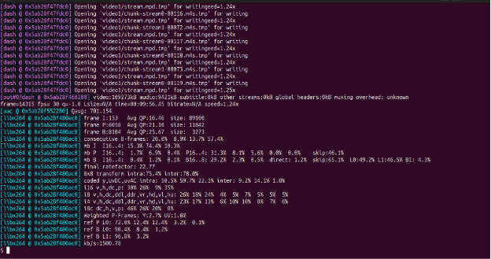
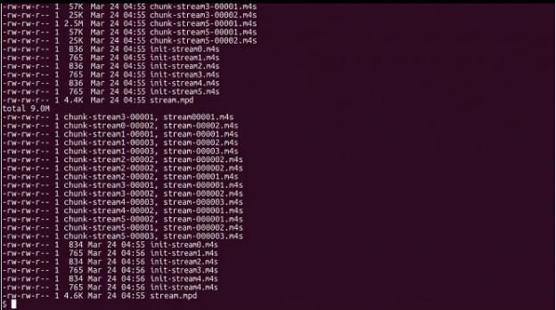
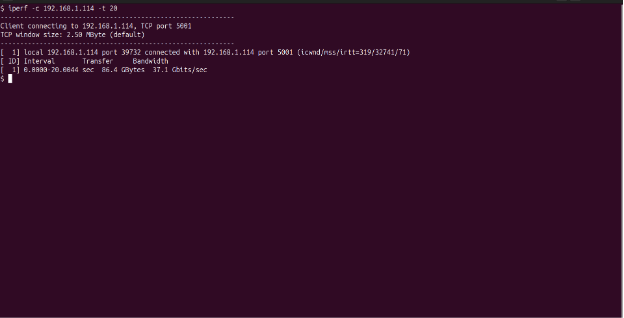
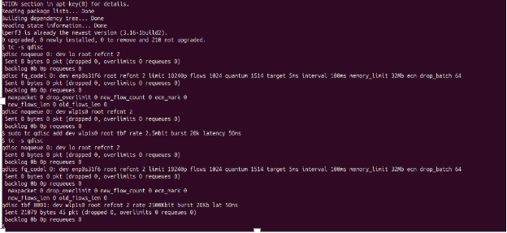
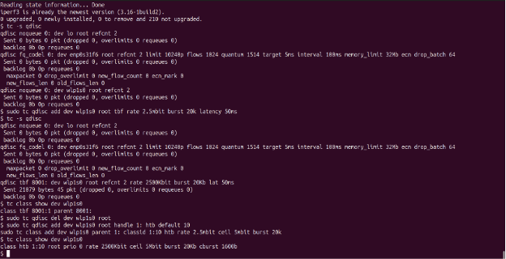

# DASH Video Streaming Project

## 📌 Overview
This project presents the implementation and evaluation of a Dynamic Adaptive Streaming over HTTP (DASH) system in a controlled virtual environment. The objective is to analyze how different network conditions affect video streaming performance and Quality of Experience (QoE). The system uses adaptive bitrate streaming to dynamically adjust video quality based on available bandwidth.

---

## 🛠️ Tools & Technologies
- FFmpeg (video encoding and processing)
- DASH (MPD manifest and segmentation)
- Apache Web Server (content delivery)
- iPerf (network traffic testing)
- Linux Traffic Control (tc)
  - Token Bucket Filter (TBF)
  - Hierarchical Token Bucket (HTB)
  - Traffic Policing

---

## 🎬 Video Processing

### FFmpeg Installation

### Transcoding (1.5 Mbps, 2 Mbps, 4 Mbps)

---

## 📦 DASH Packaging

### DASH Manifest and Segments

---

## 🌐 Web Server Configuration

### Apache Server Setup

### DASH URLs Access

---

## 📊 Network Testing

### iPerf Implementation

### Bandwidth Testing

---

## ⚙️ Traffic Control Implementation

### Token Bucket Filter (TBF)
- Rate: 2.5 Mbps  
- Burst: 20 KB  
- Latency: 50 ms  

---

### Hierarchical Token Bucket (HTB)
- Minimum Rate: 2.5 Mbps  
- Maximum Rate: 5 Mbps  

---

### Traffic Policing
- Rate Limit: 3.5 Mbps  
- Excess traffic is dropped  

---

## ▶️ Final Output

### DASH Video Playback

---

## 📈 Results & Observations
- DASH successfully adapts video quality based on available bandwidth.
- Under TBF, video quality reduces slightly but playback remains smooth.
- HTB provides better performance due to flexible bandwidth allocation.
- Traffic policing causes packet loss, leading to buffering and poor QoE.
- Packet loss has a more severe impact on streaming compared to bandwidth limitation.

---

## 🚀 How to Run the Project

1. Install FFmpeg on the server.
2. Download and verify input videos.
3. Transcode videos into multiple bitrates.
4. Generate DASH MPD and segments.
5. Configure Apache server to host content.
6. Apply traffic control rules using `tc`.
7. Use iPerf to generate network traffic.
8. Access DASH stream via browser.

---

## 👤 Author
Ashir
